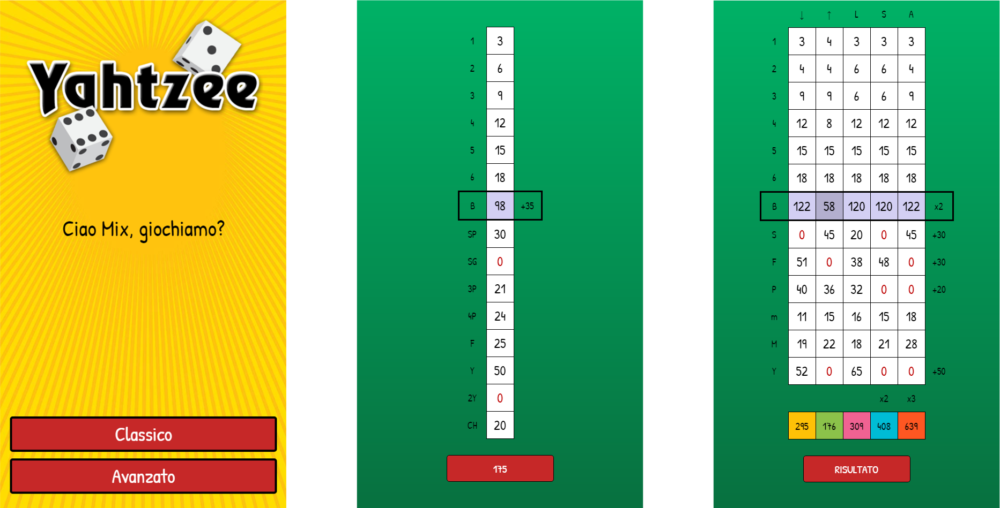
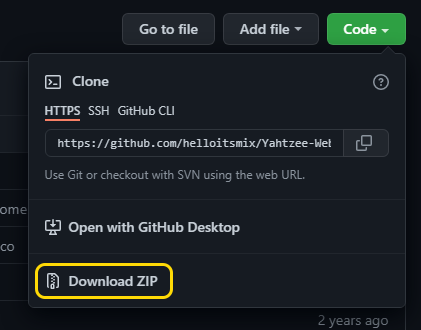

# Yahtzee

Yahtzee è un gioco di strategia che si svolge con **5 dadi**, si può giocare in una o più persone: non c'è un numero massimo di giocatori.

Questa applicazione punta a sostituire il classico blocchetto segnapunti (e matite) con un segnapunti completamente digitale, a portata di cellulare. 

- [Installazione](#installazione)
- [Regole generali](#regole-generali)
- [Modalità classica](#modalità-classica)
- [Modalità avanzata](#modalità-avanzata)

# Installazione

Il tabellone segnapunti Yahtzee lo puoi trovare online a [questo indirizzo](), oppure puoi scaricalo in locale su PC.

### Web App per Cellulare

1. Utilizzando Chrome su Android o Safari su iOS vai a [questo indirizzo]()
2. Attendi che venga caricato completamente quindi clicca _Aggiungi alla homescreen_
  
  
  
3. Gioca!

### Come scaricare su PC

1. Scarica il file ZIP della repository
 

 
2. Estrai la cartella con WinRAR o 7-Zip
3. Apri `index.html`
4. Gioca!

# Regole generali

#### L'OCCORRENTE

- 5 dadi
- Yahtzee Web App

#### OBIETTIVO

L'**obiettivo del gioco** è totalizzare il maggior numero di punti.

#### INIZIO

Ogni giocatore lancia un dado: chi totalizza il punteggio più alto parte per primo, e il gioco continua in senso orario.

#### SVOLGIMENTO DI UN TURNO

Al primo lancio il giocatore tira **tutti e cinque i dadi**.

Nei successivi due lanci il giocatore può scegliere di trattenere uno o più dadi favorevoli ad ottenere la combinazione desiderata. 
Può anche scegliere di non trattenere alcun dado o di non utilizzare successivi lanci, nel caso ad esempio si sia già realizzata una combinazione utile.

Al termine dei lanci il giocatore deve segnare **obbligatoriamente** un punteggio in una delle caselle del segnapunti non ancora utilizzata.
Se alla fine del turno di gioco non viene realizzata una delle possibili combinazioni ancora "libera" sul tabellone, oppure decida di cancellare una casella, il giocatore deve segnare "0" (zero) in una delle caselle ancora a sua disposizione.

**È possibile e obbligatorio riempire soltanto una casella per turno.**

# Modalità classica

In questa modalità ogni giocatore segna i propri punti nel proprio tabellone formato da una colonna con 14 caselle.

La modalità classica è più veloce della modalità avanzata.

#### COMBINAZIONI - PARTE SUPERIORE

##### SOMME DI NUMERI (1-2-3-4-5-6)

Nella PARTE SUPERIORE del tabellone troviamo le caselle di somma. Il giocatore deve sommare solo i dadi uguali tra di loro e segnarne il valore nella relativa casella.

> Con una combinazione di dadi `1-3-3-3-4` il giocatore può segnare 9 nella casella dei `3`

##### `B` - BONUS

La casella Bonus viene automaticamente calcolata sommando i punteggi delle combinazioni della parte superiore. Se il giocatore riesce a totalizzare 63 o più punti otterrà un bonus di 35 punti.

#### COMBINAZIONI - PARTE INFERIORE

##### `SP` - SCALA PICCOLA

Per riempire questa casella, il giocatore deve ottenere una combinazione di quattro dadi in ordine numerico.
Il punteggio finale è sempre 30.

> Con una combinazione di dadi `3-4-5-6-1` il giocatore può segnare 30 nella casella `SP`

##### `SG` - SCALA GRANDE

Per riempire questa casella, il giocatore deve ottenere una combinazione di cinque dadi in ordine numerico.
Il punteggio finale è sempre 40.

> Con una combinazione di dadi `1-2-3-4-5` il giocatore può segnare 40 nella casella `SG`

##### `3P` - TRE PEZZI

Per riempire questa casella, il giocatore deve ottenere tre dadi con lo stesso valore.
Il punteggio finale è la somma di tutti e cinque i dadi.

> Con una combinazione di dadi `5-5-5-2-4` il giocatore può segnare 21 nella casella `3P`

##### `4P` - QUATTRO PEZZI

Per riempire questa casella, il giocatore deve ottenere quattro dadi con lo stesso valore.
Il punteggio finale è la somma di tutti e cinque i dadi.

> Con una combinazione di dadi `5-5-5-5-4` il giocatore può segnare 24 nella casella `4P`

##### `F` - FULL

Per riempire questa casella, il giocatore deve ottenere tre dadi di un tipo e due di un altro.
Il punteggio finale è sempre 25.

> Con una combinazione di dadi `2-2-3-3-3` il giocatore può segnare 25 nella casella `F`

##### `Y` - YAHTZEE

Per riempire questa casella, il giocatore deve ottenere cinque dadi con lo stesso valore.
Il punteggio finale è sempre 50.

> Con una combinazione di dadi `6-6-6-6-6` il giocatore può segnare 50 nella casella `Y`

##### `2Y` - SECONDO YAHTZEE

Il giocatore può ottenere un secondo Yahtzee solo se il primo è già stato segnato.
Il punteggio finale è sempre 100.

##### `CH` - CHANCE

Quando il giocatore non riesce a realizzare nessuna combinazione o la combinazione realizzata è già stata utilizzata precedentemente può utilizzare la chance.
Il punteggio finale è la somma di tutti e cinque i dadi.

> Con qualsiasi combinazione di dadi, esempio: `2-1-5-5-2` il giocatore può segnare 15 nella casella `CH`

# Modalità avanzata

In questa modalità ogni giocatore segna i suoi punti nel proprio tabellone formato da 5 colonne per un totale di 60 caselle.

La modalità avanzata è più lunga della modalità classica.

#### COLONNE

##### `↓` - TOP DOWN

Nella prima colonna il giocatore è obbligato a riempire le caselle dall'alto verso il basso.

##### `↑` - DOWN TOP

Nella seconda colonna il giocatore è obbligato a riempire le caselle dal basso verso l'alto.

> N.B. Il giocatore, nel suo turno, può decidere di segnare "0" per cancellare una casella.

##### `L` - LIBERI

Come nella modalità classica, nella terza colonna il giocatore è **libero** di riempire le caselle a suo piacimento.

##### `S` - SECCHI

Nella quarta colonna il giocatore può riempire le caselle solo con le combinazioni ottenute al primo lancio di dadi.

Il punteggio totale della colonna dei secchi verrà raddoppiato a fine partita.

> Al primo tiro esce questa combinazione di dadi `1-3-6-3-3` il giocatore può segnare 9 nella riga dei `3` nella colonna dei secchi `S`. Se il giocatore dovesse ritirare i dadi non potrebbe più segnare il punteggio in questa colonna.

##### `A` - ANNUNCIATI

Nella quinta e ultima colonna il giocatore può riempire le caselle solo annunciando la combinazione che vuole ottenere dopo aver fatto il primo tiro.

Il giocatore una volta annunciata la combinazione è costretto a segnare su quella casella il punteggio ottenuto, oppure segnare "0" se non è riuscito ad ottenere la combinazione desiderata.

Il punteggio totale della colonna degli annunciati verrà triplicato a fine partita.

> Al primo tiro esce questa combinazione di dadi `2-2-2-3-6` il giocatore può annunciare poker e continuare coi restanti due tiri. Se alla fine dei tiri ha ottenuto poker segna il punteggio, altrimenti segna "0".

#### COMBINAZIONI - PARTE SUPERIORE

##### SOMME DI NUMERI (1-2-3-4-5-6)

Nella PARTE SUPERIORE del tabellone troviamo le caselle di somma. Il giocatore deve sommare solo i dadi uguali tra di loro e segnarne il valore nella relativa casella.

> Con una combinazione di dadi `3-3-3-1-4` il giocatore può segnare 9 nella casella dei `3`

##### `B` - BONUS

La casella Bonus viene automaticamente calcolata sommando i punteggi delle combinazioni della parte superiore. Se il giocatore riesce a totalizzare 60 o più punti otterrà un bonus raddoppiato.

#### COMBINAZIONI - PARTE INFERIORE

##### `S` - SCALA

Per riempire questa casella, il giocatore deve ottenere una combinazione di cinque dadi in ordine numerico. Le combinazioni possibili sono quindi `1-2-3-4-5` e `2-3-4-5-6`, rispettivamente 15 e 20 punti.

Il giocatore deve segnare la somma dei dadi, a cui il sistema aggiungerà automaticamente 30 punti.

> Con una combinazione di dadi `1-2-3-4-5` il giocatore può segnare 15 (+30) nella casella `S`

##### `F` - FULL

Per riempire questa casella, il giocatore deve ottenere tre dadi di un tipo e due di un altro.

Il giocatore deve segnare la somma dei dadi, a cui il sistema aggiungerà automaticamente 30 punti.

> Con una combinazione di dadi `3-3-5-5-5` il giocatore può segnare 21 (+30) nella casella `F`

##### `P` - POKER

Per riempire questa casella, il giocatore deve ottenere quattro dadi con lo stesso valore.

Il giocatore deve segnare la somma dei quattro dadi, a cui il sistema aggiungerà automaticamente 20 punti.

> Con una combinazione di dadi `4-4-4-4-2` il giocatore può segnare 16 (+20) nella casella `P`

##### `m` - minima

La minima non ha bisogno di combinazioni, è la somma di tutti e cinque i dadi. Deve essere più bassa della massima.

> Con qualsiasi combinazione di dadi, esempio: `2-1-4-4-3` il giocatore può segnare 14 nella casella `m`

##### `M` - MASSIMA

La massima non ha bisogno di combinazioni, è la somma di tutti e cinque i dadi. Deve essere più alta della minima.

> Con qualsiasi combinazione di dadi, esempio: `4-5-4-6-2` il giocatore può segnare 21 nella casella `M`

##### `Y` - YAHTZEE

Per riempire questa casella, il giocatore deve ottenere cinque dadi con lo stesso valore.

Il giocatore deve segnare la somma dei cinque dadi, a cui il sistema aggiungerà automaticamente 50 punti.

> Con una combinazione di dadi `4-4-4-4-4` il giocatore può segnare 20 (+50) nella casella `Y`

# FAQ
